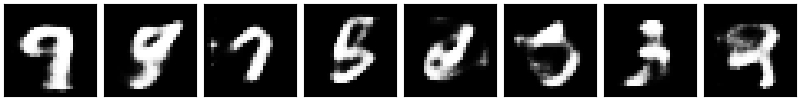
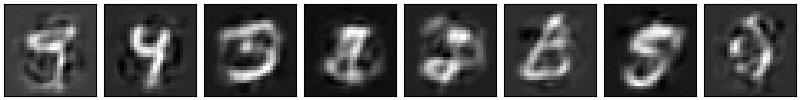

# MLP-VAE
MLP-based VAE model on MNIST dataset, implemented with PyTorch.

- Two types of decoder are implemented, i.e. the Bernoulli MLP and the Gaussian MLP. (see [the VAE paper](https://arxiv.org/abs/1312.6114))
- The encoder is considered to be a Gaussian MLP.
- Here are some random samples from the Bernoulli VAE.

- and some random samples from the Gaussian VAE.

